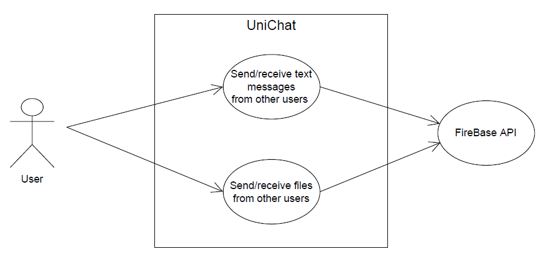

## Requirements

# Non-functional requirements:
- Technical Requirement: The feature must be developed using Flutter.
- Confidenciality: Student's messages must be encrypted to ensure a safe user experience.
- Authenticity: Copycats will not be allowed in our chats.
- Availability: Keep the servers online and available for users all of the time.
- Recoverability: Messages will always be stored in the cloud for recoverability in case the servers crash.
- Performance: Fast and efficient use of resources is required for a good performance.
- Co-existence: Firebase is required for its servers and databases and Sigarra for student information.
- Operability: Offline students should be able to put messages on hold until back online.
- User inteface aesthetics: The interface must be user friendly to ensure smooth communication.

# Functional requirements:
- Sending and receiving messages and files between students.
- Automatic creation of the different chats.
### Use case model 

|||
| --- | --- |
| *Name* | Send/receive text messages from other users |
| *Actor* |  User(student) | 
| *Description* | Each student sends and receives messages from other students of their classes. |
| *Preconditions* | - The student is logged in the app and is enrolled in some course.   - The "target" group chat is already active.|
| *Postconditions* | - The message is sent.   - The remaining members of the group receive the message.   - Message storage is updated. |
| *Normal flow* | 1. The user accesses the chat feature in the Uni app.  2. The system shows the list of the available group chats (one per course).  3. The user chooses the group where he wants to send the message.   4. The system displays the history of messages and files sent in the group and gives the possibility to type a new message.   5. The message is written and sent to the other members.   6. Firebase stores the message.

|||
| --- | --- |
| *Name* | Send/receive files from other users |
| *Actor* |  User(student) | 
| *Description* | Each student sends and receives files from other students of their classes. |
| *Preconditions* | - The student is logged in the app and is enrolled in some course.   - The "target" group chat is already active.|
| *Postconditions* | - The file is sent.   - The remaining members of the group receive the file.   - File storage is updated. |
| *Normal flow* | 1. The user accesses the chat feature in the Uni app.  2. The system shows the list of the available group chats (one per course).  3. The user chooses the group where he wants to send the file.   4. The system displays the history of messages and files sent in the group and gives the possibility to type a new message. 5. The file is selected and sent to the other members.   6. Firebase stores the message.
| *Alternative flows and exceptions* | 1. [File too large] If, in step 5 of the normal flow the selected file is too large (>15 MB) the system warns the user and gives the possibility to cancel or to choose another file. |

|||
| --- | --- |
| *Name* | Access sent messages and files |
| *Actor* |  User | 
| *Description* | The user has access to all the messages (and files) that were sent and received in every group chat he participates in. |
| *Preconditions* | - The student is logged in the app and is enrolled in some course.   - The "target" group chat is already active.|
| *Postconditions* | -  The messages and files are displayed to the user.|
| *Normal flow* | 1. The user accesses the chat feature in the Uni app.  2. The system shows the list of the available group chats (one per course).  3. The user chooses the group whose history he wants to consult.   4. All the messages and files are shown to the user.

### User stories
The user stories should be created as GitHub issues. Therefore, this section will *not* exist in your report, it is here only to explain how you should describe the requirements of the product as **user stories**. 

A user story is a description of desired functionality told from the perspective of the user or customer. A starting template for the description of a user story is 

*As a < user role >, I want < goal > so that < reason >.*

User stories should be created and described as [Issues](https://github.com/LEIC-ES-2021-22/templates/issues) in GitHub with the label "user story". See how to in the video [Creating a Product Backlog of User Stories for Agile Development using GitHub](https://www.youtube.com/watch?v=m8ZxTHSKSKE).

You should name the issue with the text of the user story, and, in the "comments" field, add any relevant notes, the image(s) of the user interface mockup(s) (see below) and the acceptance test scenarios (see below). 

**INVEST in good user stories**. 
You may add more details after, but the shorter and complete, the better. In order to decide if the user story is good, please follow the [INVEST guidelines](https://xp123.com/articles/invest-in-good-stories-and-smart-tasks/).

**User interface mockups**.
After the user story text, you should add a draft of the corresponding user interfaces, a simple mockup or draft, if applicable.

**Acceptance tests**.
For each user story you should write also the acceptance tests (textually in [Gherkin](https://cucumber.io/docs/gherkin/reference/)), i.e., a description of scenarios (situations) that will help to confirm that the system satisfies the requirements addressed by the user story.

**Value and effort**.
At the end, it is good to add a rough indication of the value of the user story to the customers (e.g. [MoSCoW](https://en.wikipedia.org/wiki/MoSCoW_method) method) and the team should add an estimation of the effort to implement it, for example, using t-shirt sizes (XS, S, M, L, XL).

### Domain model

To better understand the context of the software system, it is very useful to have a simple UML class diagram with all the key concepts (names, attributes) and relationships involved of the problem domain addressed by your module. 
Also provide a short textual description of each class. 

Example:
 

  

