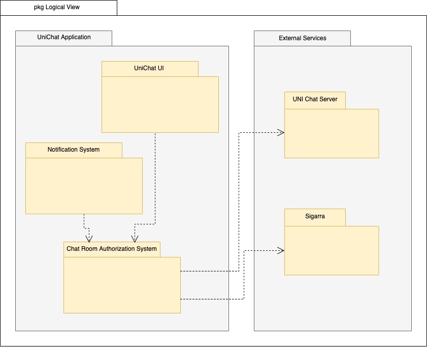
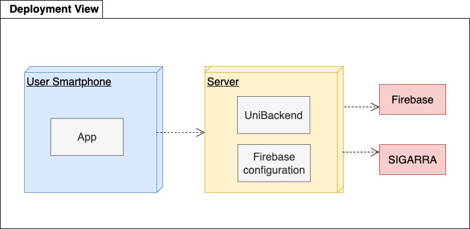

## Architecture and Design

The UniChat app takes use of the Flutter SDK to realize backend access and in association with the Android SDK make the frontend of the app. The backend is responsible for the constant chat synchronization between local and database chat, through the use of Firebase, and for the retrieval of student information from Sigarra, most importantly, making sure the student's class groups are constantly updated. The frontend is responsible for providing the functionalities of the app to the users.

### Logical architecture

The UniChat Application is constituted by the user interface (UniChat UI), the Notification System and the Chat Room Authorization System. Both the User Interface and Notification System take use of the Chat Room Authorization System to garantee the connection with Sigarra, for student information, and UNI Chat Server, for chat database which is managed Firebase.

### Logical architecture

### Physical architecture

The user smartphone will have our app installed, made with Flutter. This app will access our backend server which is made up of the UNI backend and our Firebase Configuration. The Server will then use the external services Firebase (database) and SIGARRA (student information) for its functioning.

### Vertical prototype
To help on validating all the architectural, design and technological decisions made, we usually implement a vertical prototype, a thin vertical slice of the system.

In this subsection please describe in more detail which, and how, user(s) story(ies) were implemented. 

At this phase, instead of a concret user story, you can simply implement a feature that demonstrates thay you can use the technology, for example, show a screen with the app credits (name and authors).
